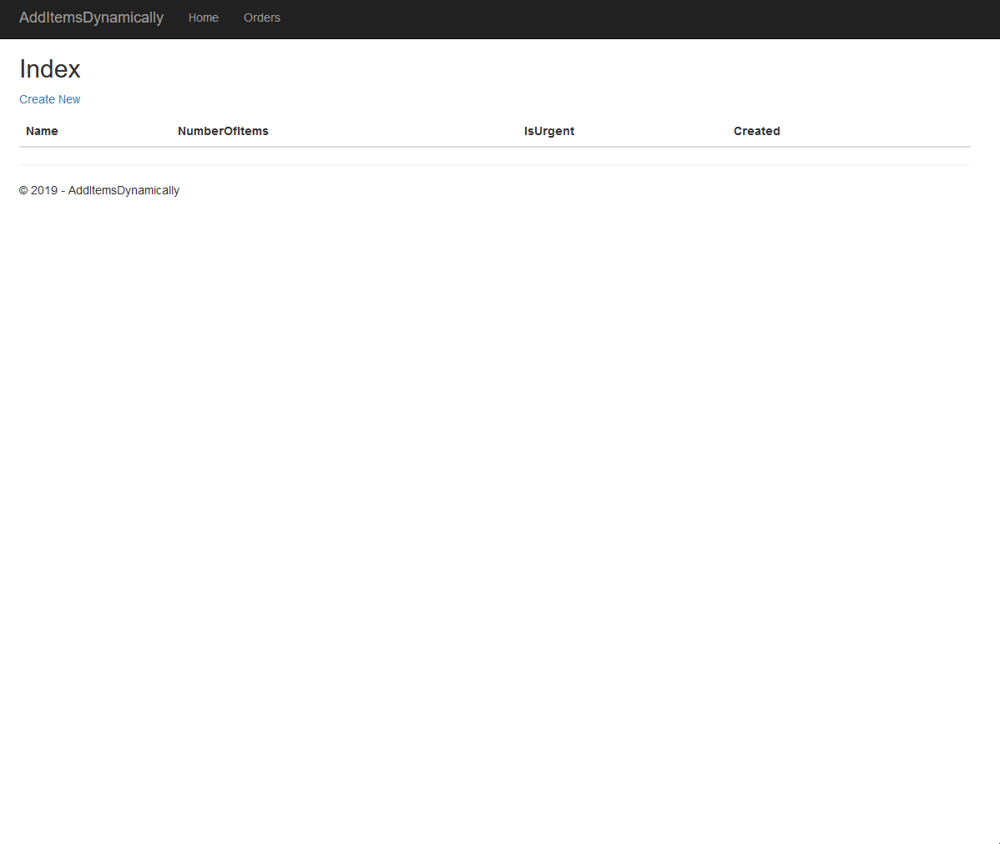
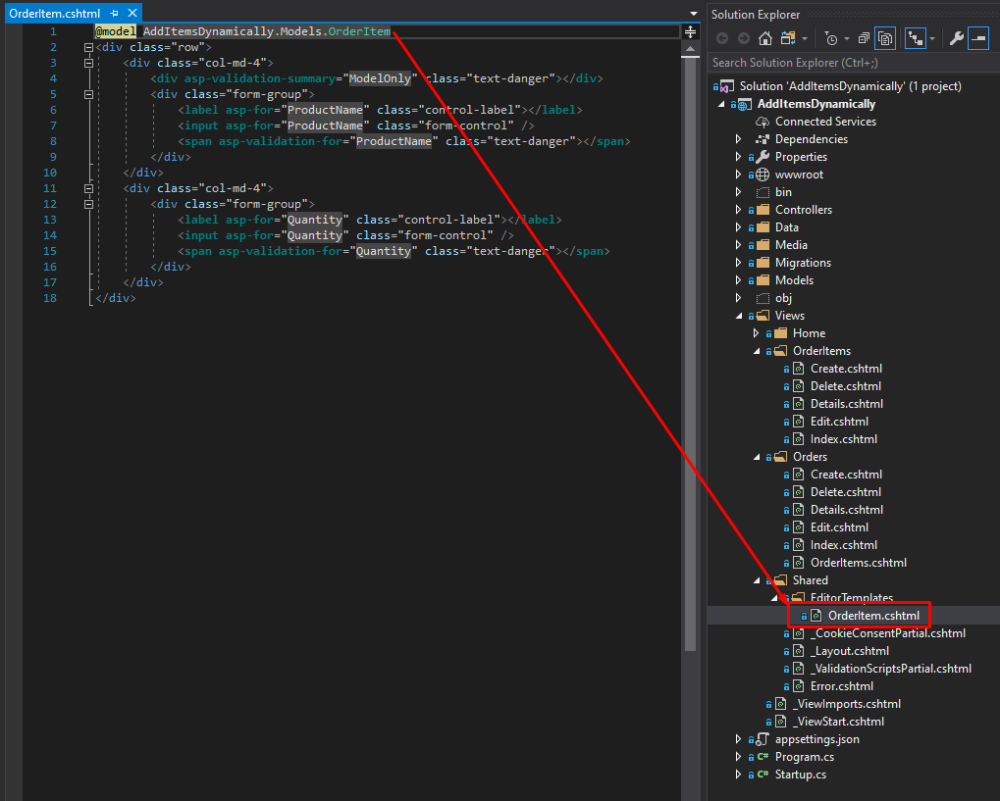
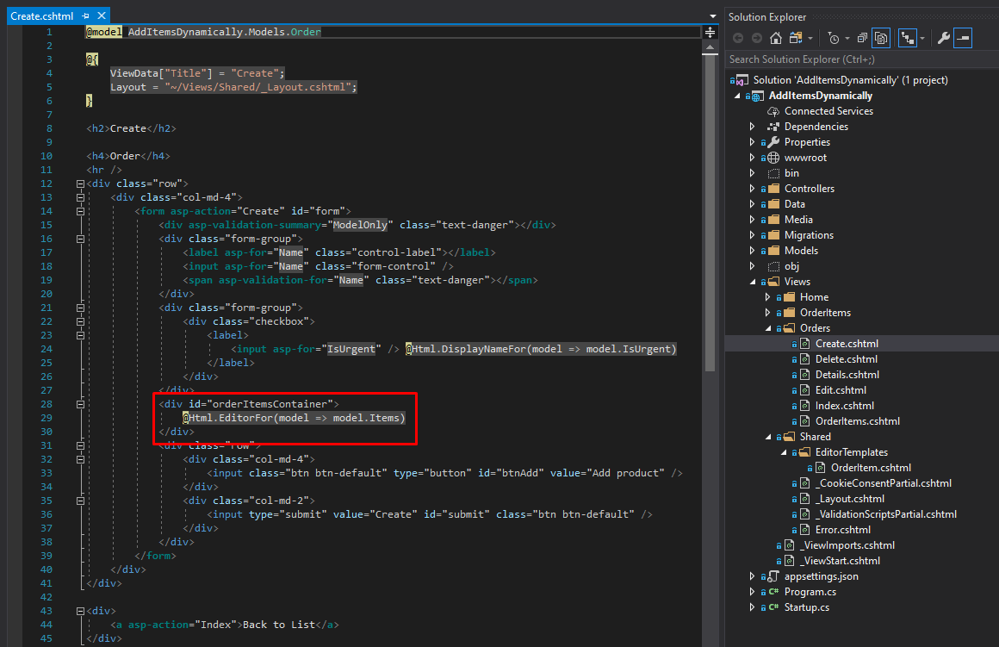
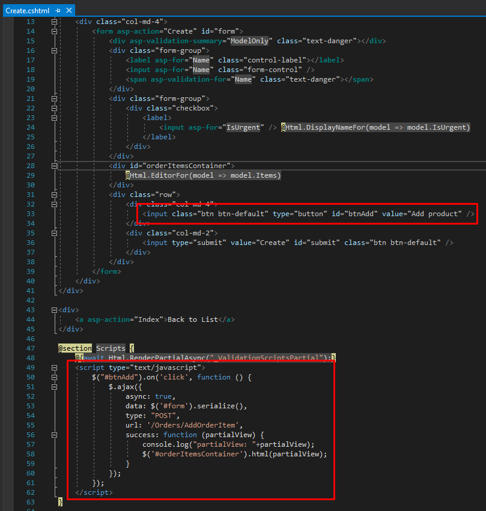
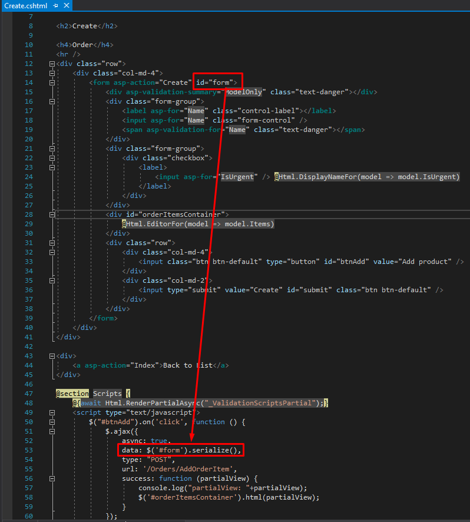
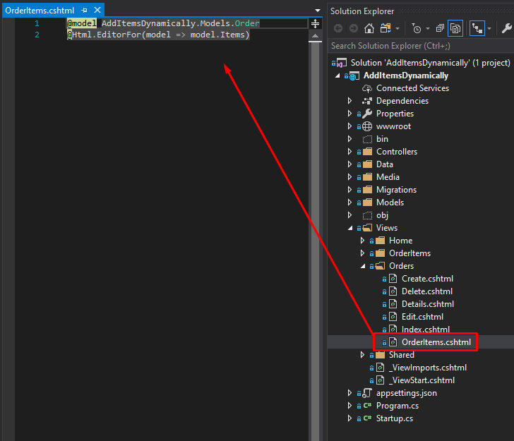
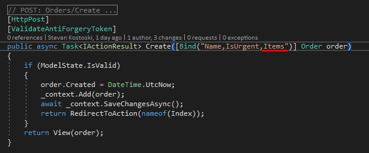
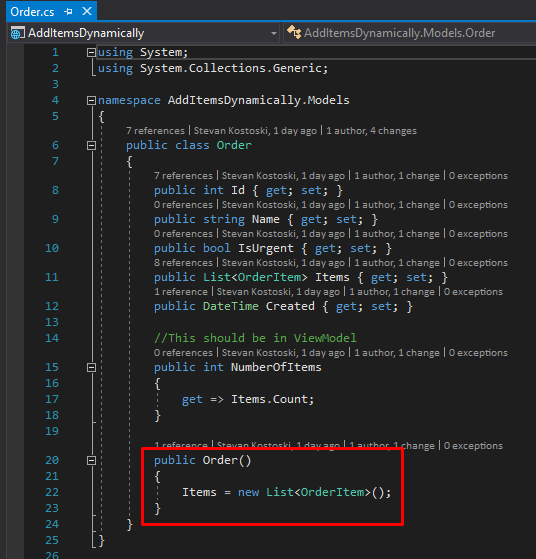

# AddItemsDynamically
Very often there is a need to add items in a collection of items. Usually we have some object that holds a list of complex objects, for
example, one Order contains several OrderItems which are complex objects (has their properties). When creating a Controller and View for such object, Razor ignores these properties and doesn't create input fields for them.
In this example, I can show you how I solve this problem without refreshing the page.

One of the first thins that you should do is to create an Editor for the Objects that are in the list, in this example the order items.
This editor is simple copy-paste from its Edit.cshtml file, but remember to remove the 'form' element, otherwise, the submit button
will not work. Name of the editor must be the same as the name of the model that you're editing, in this case OrderItem and place it under Views/Shared/EditorTemplates. If you don't have the EditorTemplates folder under Shared, create it.

When we have the Editor we can use it in the Create.cshtml file to display the collection of the items. Usualy we place this part in separate div element with specific id (in this case it's id="orderItemsContainer" so we can later change the content of this div with ajax.

After displaying the items, we should create a button that can be pressed to add a new element to the list. Let's create the Add Button together with the javascript code, that will be used for the ajax call.

To be able to serialize this form, we should also add ID to the form in the create file.

As you noted, we call a method AddOrderItem from Orders controller in the javascript ajax method, and this method we should also create in the controller and set up its binding. This method in the controller is adding a new element to the list and rendering the whole list as a partial view which is later shown in the HTML. 

In the AddOrderItem method we're returning PartialView where we render the list of the order items. Create a partial view in your Views/Order folder called OrderItems.cshtml. The Partial view is prretty much simple, it should only use the editor that we created previously.

When we have everything shown on the screen, now we should add the binding for the list in the create method of the controller and we are ready to use it (include Items in the binding list, because they are not included by default).

Notice that we changed the model, we added a default constructor that will initialize the list. Also i've added a property that will give us the total number of items in the list, usualy this logic should be in ViewModel, but for the sake of simplicity i put it in the model.

